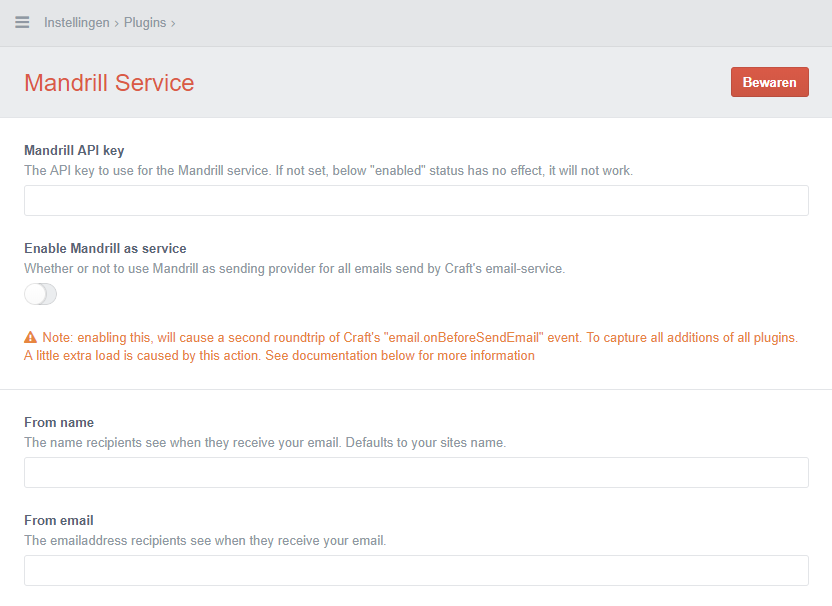

# Mandrill service plugin for Craft CMS (v2)

This plugin provides the ability to send emails via Mandrill API. It also can control all of the emails send by Craft's EmailService being captured for sending to Mandrill. Read below for more information.

<!-- TOC depthFrom:2 -->

- [Installation](#installation)
    - [Composer vendor files](#composer-vendor-files)
    - [Enable the plugin in Craft](#enable-the-plugin-in-craft)
    - [Configuration settings](#configuration-settings)
        - [API Key](#api-key)
        - [Enable as a service](#enable-as-a-service)
        - [From settings](#from-settings)
        - [Craft's general config to override](#crafts-general-config-to-override)
- [Take over control of all outgoing emails](#take-over-control-of-all-outgoing-emails)
    - [Manually use the service](#manually-use-the-service)
- [Events](#events)
    - [email.onBeforeSendEmail](#emailonbeforesendemail)
    - [email.onSendEmail](#emailonsendemail)
    - [email.onSendEmailError](#emailonsendemailerror)
- [Examples](#examples)
    - [Add-in tags](#add-in-tags)
    - [Using attachments](#using-attachments)
    - [Set a schedule date/time](#set-a-schedule-datetime)

<!-- /TOC -->

## Installation

From the root of your Craft installation, just run composer to install this plugin;

```terminal
composer require bertoost/craft-mandrill-service-plguin
```

This will install the plugin inside your `craft/plugins/` folder automatically.

### Composer vendor files

It also brings some other vendor files inside the `vendor/` directory in your project root. This can be ignored by your VCS or included when you aren't able to run `composer install` at your hosting-server.

Maybe your installation is configured to use another path structure. If the plugin can't find the Composer `vendor/` folder, it will notify you in the admin panel. To solve it, you can tell us where to find the `vendor/` folder. Just add this line to your websites' index.php file, just below the `$craftPath` definition.

```php
define('COMPOSER_VENDOR_PATH', realpath('../vendor/'));
```

### Enable the plugin in Craft

Navigate to Craft's settings > Plugins > Install `Mandrill Service` plugin.

### Configuration settings



#### API Key

After installation you have to configure the plugin to work at all. Navigate to the plugin settings page and enter the API key you want to use.

__Remember:__ Mandrill provides the ability to have a test-API-key. You can test it as many times you want without having a paid account already. Login to Mandrill and activate a "Test" API key.

#### Enable as a service

There are two ways of using this plugin. You can use the Mandrill service or let it take over control of sending any email, sent by Craft's EmailService. This is a setting in the plugin;

#### From settings

The from email and name settings are meant to configure the sender name for your site/application. This can be overwritten when using manual service, but this config settings are used by default.

#### Craft's general config to override

You can pass the following settings to the `general.php` configuration file of Craft, to override the settings in the settings page from the plugin.

```php
return [
    // ...
    'mandrillEnabled'   => false,
    'mandrillApiKey'    => 'TheKeyFromMandrill',
    'mandrillFromEmail' => 'you@address.mail',
    'mandrillFromName'  => 'Your Sender Name',
];
```

## Take over control of all outgoing emails

__Downside (read carefully):__

The plugin hooks on the `email.onBeforeSendEmail` event and disables any further process of Craft's EmailService (by setting `$event->performAction = false;`). It also will re-fire that event, to be sure all data from any plugin is captured before sending it.

So, why is this a bad thing?
Because it can happen (actually: it will!) that your plugin already did it's work before this event reaches the Mandrill-take-over part. But when not, we fire the event again to be sure it will. This will cause a second roundtrip of the `email.onBeforeSendEmail` event.
Depending on what happens on this event, it can slow down the process!

If you're building heavy stuff on this event, it can be good to check if you did your thing already. Like this;

```php
craft()->on('email.onBeforeSendEmail', function (Event $event) {

    // check if we've been here before
    if (!isset($event->params['myplugin_beenHere'])) {

        // do your stuff here

        $event->params['myplugin_beenHere'] = true;
    }
});
```

It will not stop coming here twice, but the hard part (or load/performance taking part) of your code will be skipped.

### Manually use the service

It's also possible to use the Mandrill service manually.

```php
$variables = [
    // any template variables
];

$htmlBody = /* Some HTML content, parsed by Twig?! */;
$plainTextBody = /* Some plain text content, parsed by Twig?! */;

craft()->mandrill
    ->addTo('email@ddre.ss', 'Sender Name')
    ->setContent($htmlBody, $plainTextBody, $variables)
    ->send();
```

Using Craft's messages system

```php
// get any UserModel anyhow, example:
$user = craft()->users->getUserByEmail('me@example.com');

$variables = [
    // any template variables
];

craft()->mandrill
    ->setUser($user)
    ->setByEmailKey('the_message_key', $variables)
    ->send();
```

## Events

The Craft email events are still being used. They contain the same params as the event is getting from Craft's default EmailService.

```php
[
    'user'       => /* an UserModel */,
    'emailModel' => /* an EmailModel */,
    'variables'  => /* an array of variables */,

    // and on error:
    'error'      => /* error message */,
]
```

Additional params are added by the Mandrill service

### email.onBeforeSendEmail

```php
[
    // ...
    '_mandrill'    => true,
    'emailMessage' => /* a Mandrill_MessageModel */,
]
```

### email.onSendEmail

```php
[
    // ...
    '_mandrill'    => true,
    'emailMessage' => /* a Mandrill_MessageModel */,
    'result'       => /* array of the Mandrill API result */,
]
```

### email.onSendEmailError

```php
[
    // ...
    '_mandrill'    => true,
    'emailMessage' => /* a Mandrill_MessageModel */,
]
```

## Examples

Find some example usages below

### Add-in tags

Your plugin can add tags to email messages easily since the `emailMessage` is passed by the events given by the Mandrill plugin. Example;

__When using service manually;__

```php
// attachment as content
craft()->mandrill
    // ...
    ->addAttachment('my.pdf', $fileContents, 'application/pdf');

// or as a file path
craft()->mandrill
    // ...
    ->addAttachmentFile('path/to/my.pdf', 'alternate-name.pdf', 'application/pdf')
```

__When the "Mandrill as service" is on;__

```php
craft()->on('email.onBeforeSendEmail', function (Event $event) {

    // to be sure it happens when Mandrill is here
    if (isset($event->params['_mandrill'])) {

        // single one
        $event->params['emailMessage']
            ->addTag('Tag name one')
            ->addTag('Tag name two');

        // or as array
        $event->params['emailMessage']
            ->addTag(['Tag name one', 'Tag name two']);

        // based on messages-system email-key
        switch ($event->params['variables']['emailKey']) {
            case 'forgot_password':
                $event->params['emailMessage']
                    ->addTag('Forgot password');
                break;
        }
    }
});
```

### Using attachments

__When using service manually;__

```php
// attachment as content
craft()->mandrill
    // ...
    ->addAttachment('my.pdf', $fileContents, 'application/pdf');

// or as a file path
craft()->mandrill
    // ...
    ->addAttachmentFile('path/to/my.pdf', 'alternate-name.pdf', 'application/pdf')
```

__When the "Mandrill as service" is on;__

```php
craft()->on('email.onBeforeSendEmail', function (Event $event) {

    // to be sure it happens when Mandrill is here
    if (isset($event->params['_mandrill'])) {

        $event->params['emailMessage']
            ->addAttachment('my.pdf', $fileContents, 'application/pdf');
    }
});
```

### Set a schedule date/time

__When using service manually;__

```php
$dateTime = new DateTime();
$dateTime->modify('+2 hours');

craft()->mandrill
    // ...
    ->setSentAt($dateTime);
```

__When the "Mandrill as service" is on;__

```php
craft()->on('email.onBeforeSendEmail', function (Event $event) {

    // to be sure it happens when Mandrill is here
    if (isset($event->params['_mandrill'])) {

        $dateTime = new DateTime();
        $dateTime->modify('+2 hours');

        $event->params['mandrillSentAt'] = $dateTime;
    }
});
```